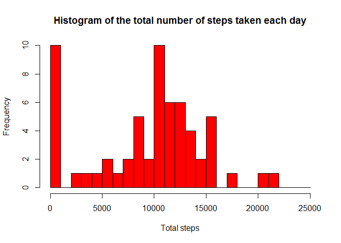
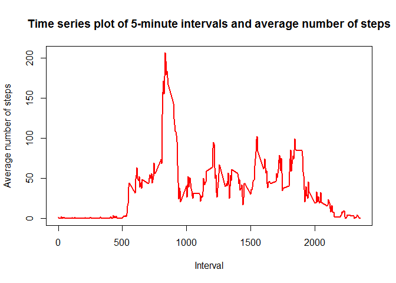
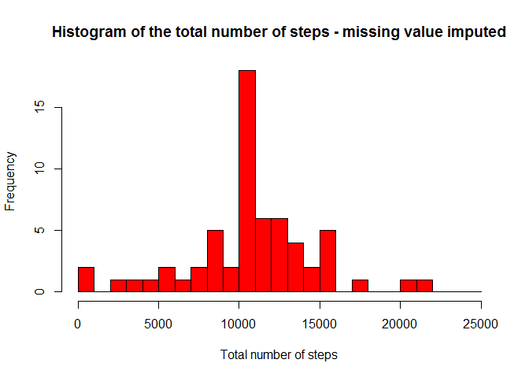
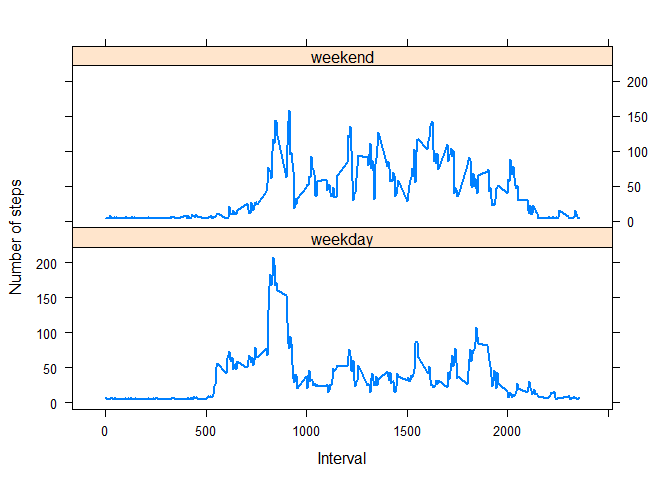

# Reproducible Research: Peer Assessment 1

## Loading and preprocessing the data
In this first step, we'll load the data into R then process it into a suitable format.


```r
# Load the data
setwd("~/Coursera/Course 5 - Reproducible research/Project1")
mydata <- read.csv("activity.csv", header = TRUE, sep = ',', na.strings="NA")

# Set format for the date column 
mydata$date <- as.POSIXct(mydata$date, format="%Y-%m-%d")
```


## What is mean total number of steps taken per day?
* Calculate the total number of steps taken per day

```r
steps_daily <- tapply(mydata$steps, mydata$date, sum, na.rm=TRUE)
```

* Make a histogram of the total number of steps taken each day

```r
hist(steps_daily, 
     breaks=seq(from=0, to=25000, by=1000),
     col="red",
     xlab="Total steps", 
     main="Histogram of the total number of steps taken each day")
```

<!-- -->

* Calculate and report the mean and median of the total number of steps taken per day

```r
meansteps <- round(mean(steps_daily), digits=2)
mediansteps <- median(steps_daily)
```

1. Mean: 9354.23
2. Median: 10395

## What is the average daily activity pattern?
* Time series plot of the 5-minute interval and the average number of steps taken, averaged across all days

```r
library(ggplot2)

steps_byinterval <- aggregate(mydata$steps, 
                       by=list(mydata$interval), 
                       FUN=mean, 
                       na.rm=TRUE)
names(steps_byinterval) <- c("interval", "avge_steps")

plot(steps_byinterval$interval, 
     steps_byinterval$avge_steps, 
     type="l", 
     col="red", 
     lwd=2, 
     xlab="Interval", 
     ylab="Average number of steps", 
     main="Time series plot of 5-minute intervals and average number of steps")
```

<!-- -->

* Which 5-minute interval, on average across all the days in the dataset, contains the maximum number of steps?

```r
max_int <- steps_byinterval[which.max(steps_byinterval$avge_steps),1]
```

The answer is 835

## Imputing missing values
* Calculate and report the total number of missing values in the dataset 

```r
missing_count <- sum(is.na(mydata$steps))
```
The total number of missing values in the dataset is: 2304

* Fill in all of the missing values in the dataset - based on the mean number of steps

```r
library(Hmisc)
```

```
## Loading required package: lattice
```

```
## Loading required package: survival
```

```
## Loading required package: Formula
```

```
## 
## Attaching package: 'Hmisc'
```

```
## The following objects are masked from 'package:base':
## 
##     format.pval, round.POSIXt, trunc.POSIXt, units
```

```r
#  new dataset that is equal to the original dataset but with the missing data filled in
mydata_nomissing <- mydata
mydata_nomissing$steps <- impute(mydata$steps, fun=mean)
```

* Histogram of the total number of steps taken each day

```r
# Total number of steps taken each day

steps_daily_nomiss <- aggregate(mydata_nomissing$steps, by=list(mydata_nomissing$date), FUN=sum)
names(steps_daily_nomiss) <- c("date", "steps")

# Histogram
hist(steps_daily_nomiss$steps, 
     breaks=seq(from=0, to=25000, by=1000),
     col="red", 
     xlab="Total number of steps", 
     main="Histogram of the total number of steps - missing value imputed")
```

<!-- -->

When missing values are imputed using the mean number of steps, the mean and median total number of steps taken per day become:

```r
mean_nomiss <- mean(steps_daily_nomiss$steps)
median_nomiss <- median(steps_daily_nomiss$steps)
```
1.    Mean: 1.0766189\times 10^{4} 
2.    Median: 1.0766189\times 10^{4}

These values differ  from the estimates obtained when no imputing of missing values is performed.

## Are there differences in activity patterns between weekdays and weekends?
* Create a new factor variable in the dataset with two levels - "weekday" and "weekend" indicating whether a given date is a weekday or weekend day.

```r
library(dplyr)
```

```
## 
## Attaching package: 'dplyr'
```

```
## The following objects are masked from 'package:Hmisc':
## 
##     combine, src, summarize
```

```
## The following objects are masked from 'package:stats':
## 
##     filter, lag
```

```
## The following objects are masked from 'package:base':
## 
##     intersect, setdiff, setequal, union
```

```r
mydata_nomissing <- mutate(mydata_nomissing, daytype = ifelse(weekdays(mydata_nomissing$date) == "Saturday" | 
                                                              weekdays(mydata_nomissing$date) == "Sunday", 
                                                              "weekend", "weekday"))
mydata_nomissing$daytype <- as.factor(mydata_nomissing$daytype)
```

* Make a panel plot containing a time series plot of the 5-minute interval and the average number of steps taken, averaged across all weekday days or weekend days

```r
by_daytype <- aggregate(steps ~ interval + daytype, data=mydata_nomissing, mean)

xyplot(steps ~ interval | daytype, by_daytype, 
       type="l", 
       lwd=2, 
       xlab="Interval", 
       ylab="Number of steps", 
       layout=c(1,2))
```

<!-- -->
